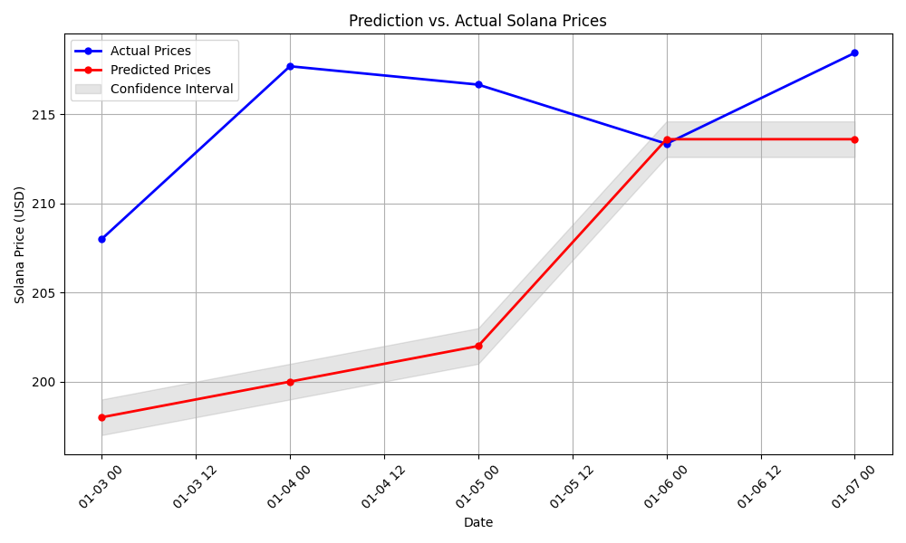

# ID2223-final-project
An MLOPS pipeline for predicting cryptocurrency prices.

Athanasia Farmaki, farmaki@kth.se

Michail Roussos, michailr@kth.se

GitHub Pages URL: https://natassaf.github.io/ID2223-final-project/

# Problem Description

We implemented an MLOPS pipeline for predicting Solana prices. As input we are using historical Solana prices, Bitcoin prices and the Fear and Greed index. We saved all the data in Hopsworks. We created a GitHub Actions Workflow so that every day we fetch the new data and make new predictions. We are also creating some graphs that are also updated daily.

## Data

We downloaded historical data for Bitcoin and Solana from url [1] in the sources and stored it locally. We also get all the fear and greed index info from url [2] in the sources. We created three feature groups, one for solana, one for bitcoin and one for the fear and greed index. We start by storing in the respective feature groups the historical data. Then everyday that the workflow is executed the data is updated with recent values, before we make predictions.

## Tools

The framework we are using for the model is tensorflow's keras, sklearn for the scalers and the metric's calculation and matplotlib and seaborn for the plots.

## Method

For the predictions we used an LSTM Model. We have trained the model and now everyday when the workflow is executed new predictions will be made for the following 10 days. New plots are also being created to depict the updated data.

Long Short-Term Memory (LSTM) is a type of recurrent neural network (RNN) architecture designed to effectively model and learn from sequential or time-series data. It was specifically developed to address the shortcomings of traditional RNNs such as the vanishing/exploding gradients during training. We chose LSTM for this task because it is particularly well-suited for time-series prediction problems like forecasting cryptocurrency prices.

## Instructions

1. Get the code from the repository.
2. Go to the 1st URL from the sources and create an API key.
3. Go to Hopsworks.com and create an account and an API key.
4. You need to create an python env (e.g. conda env) based on the 'requirements.txt' file.
5. You need to set as environment variables the two keys as "HOPSWORKS_API_KEY" and "CRYPTO_API_KEY".
6. Alternatively you can create a ".env" file and add the two keys there, but adjustments may be needed in the files.
7. Run the files with the following order "feature_backfill", "feature_pipeline", "training_pipeline", "inference_pipeline" and "plots".
8. If you want to run the workflow in github you need to also create the two keys in the repository secrets.

## Sources
[1] https://developers.cryptocompare.com/documentation/data-api/spot_v1_historical_days
[2] https://alternative.me/crypto/fear-and-greed-index/#api

# Results - Solana Price Prediction Dashboard

## Solana Price Predictions
Here we can see the price predictions for Solana from our model.

## Model Performance Monitoring
Here we can see a comparison between our predictions and the actual values.

## Correlation HeatMap
Here we have the correlation heatmap for the open values of Solana, Bitcoin and Fear and Greed index.

## Trend Analysis
Here we have the trend analysis for the open values of Solana (actual and predictions), Bitcoin and Fear and Greed index.

## References

1. Introduction to Long Short-Term Memory (LSTM) - Analytics Vidhya blog post, March 2021.
